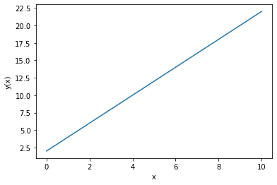
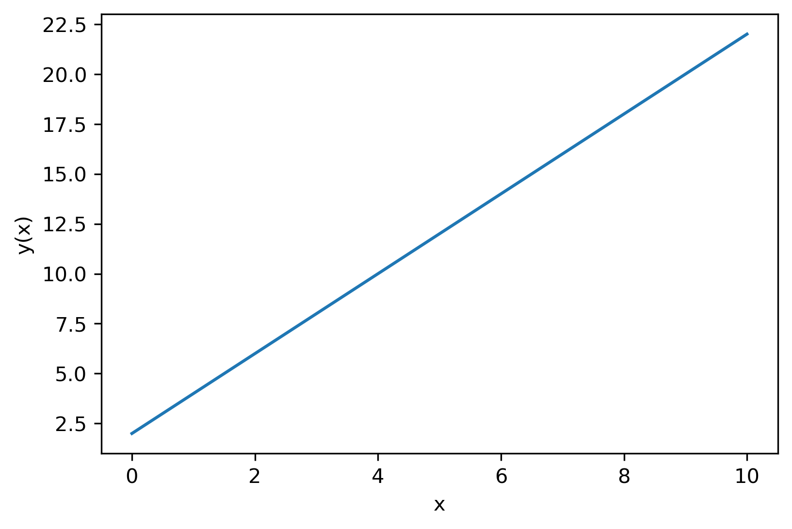
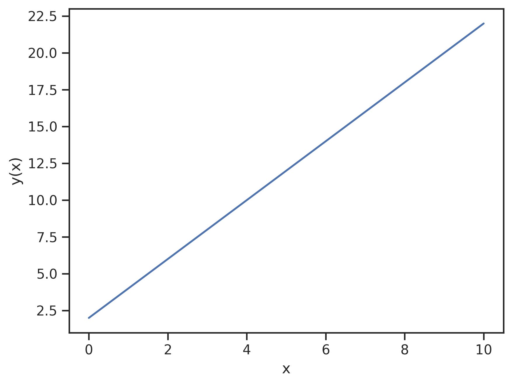
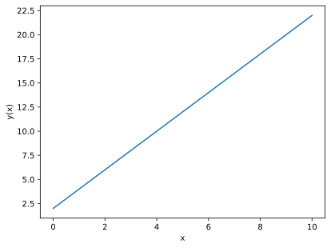

<table>
<tr>
 <td> <a href="#pybilt"></a> </td>  
<td> <a href="#gleipnir"></a> </td>
</tr>
</table>

 Matplotlib can be a powerful tool for Python-based plotting, but if you've ever generated your plots inline within a Jupyter notebook you probably noticed that the default resolution of the rendered plot images is pretty low, which can leave your plots looking blurry/grainy and hard to read. This can be troublesome, particularly if you are planning to share your notebook or export it to another format.

 In this post, I'll share two ways to change default settings so that matplotlib plots come out with better resolution both inline and when exported (for example, with nbconvert).

Okay, first things first, let's do our initial imports and setup. We can import pyplot and give our notebook magic command to inline matplotlib figures:
```python
import matplotlib.pyplot as plt
%matplotlib inline
```
Here is the code for the test data set I used to generate the plots in this post:
```python
import numpy as np
x = np.linspace(0,10,100)
y = 2*x + 2.
```

And here is the default plot outcome:
```python
plt.plot(x, y)
plt.xlabel("x")
plt.ylabel("y(x)")
```


Pretty blurry...  

## Solution 1. Change the default dpi settings in matplotlib
By default the plots rendered in our notebooks are png format with a relatively low resolution. Although this first solution isn't necessarily Jupyter notebook specific, we use the following commands to increase the default pixel density used for our matplotlib plots via [matplotlib's rcParams](https://matplotlib.org/3.2.1/tutorials/introductory/customizing.html#matplotlib-rcparams).:
```python
plt.rcParams['figure.dpi'] = 300
plt.rcParams['savefig.dpi'] = 300
```
I like 300 (i.e., 300 dpi), but you can adjust to your liking; for reference, I think the default dpi is 78. Note that `figure.dpi` will increase the pixel for inlined renderings while `savefig.dpi` is needed if you plan to export the notebook (e.g., using nbconvert) with its plots.

Now let's see the new plot with updated resolution:
```python
plt.plot(x, y)
plt.xlabel("x")
plt.ylabel("y(x)")
```

Much clearer! (However, Jupyter has the quirk of increasing the image size too when you increase the figure dpi. I'm not sure why or how to alter this behavior without explicitly setting figure size via rcParams).

### Seaborn version
If you are [seaborn](https://seaborn.pydata.org/) user, you can achieve similar results by with the following:
```python
import seaborn as sns
sns.set(rc={"figure.dpi":300, 'savefig.dpi':300})
sns.set_context('notebook')
sns.set_style("ticks")
```

And the plot for comparison:
```python
plt.plot(x, y)
plt.xlabel("x")
plt.ylabel("y(x)")
```


## Solution 2. Change the default image format to a vector format
As noted in the previous section, the default format for the plots rendered in our notebooks is png with a relatively low resolution. With the first solution, we improved resolution by simply increasing matplotlib's default pixel density. In this case, we will avoid the pixel density issue altogether by switching the default format of plot renderings to a re-scalable vector format - I learned this trick from [this blog post](http://blog.rtwilson.com/how-to-get-nice-vector-graphics-in-your-exported-pdf-ipython-notebooks/). We can add the following commands after our pyplot import and inline magic to change the default format (or even have the notebook store plots in multiple image formats):
```python
from IPython.display import set_matplotlib_formats
set_matplotlib_formats('svg')
```
The first line imports the special function we need from the IPython.display module and in the second line we set the image format we want the notebook use for matplotlib plots; I chose svg here, but you could also try other vector formats such pdf. Here is the resulting plot:   
```python
plt.plot(x, y)
plt.xlabel("x")
plt.ylabel("y(x)")
```
         
Much nicer than the default!   

I should note that we could also do the above with matplotlib's rcParams, for example by using:
```python
plt.rcParams['figure.format'] = 'svg'
```
However, the `set_matplotlib_formats` function is a little more powerful within the Jupyter notebook setting, as you can also tell the notebook to render matplotlib plots in multiple formats; e.g.:
```python
from IPython.display import set_matplotlib_formats
set_matplotlib_formats('svg', 'pdf')
```
which could be useful if you want to export the notebook itself to different formats (like markdown to share on the web and pdf to send to a colleague).


Well, that's it. Thanks for stopping by, and I hope these tips help you get nicer looking matplotlib plots inline and on export from your Jupyter notebooks.

Like this content? You can follow this blog and get updated about new post via its RSS/Atom Feed.

Until next time -- Blake
